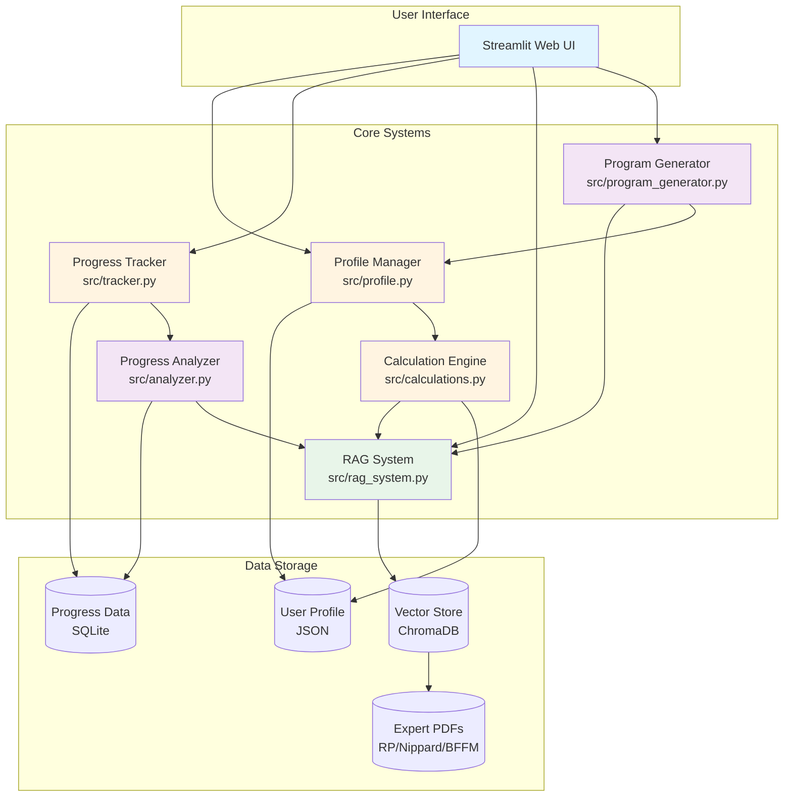
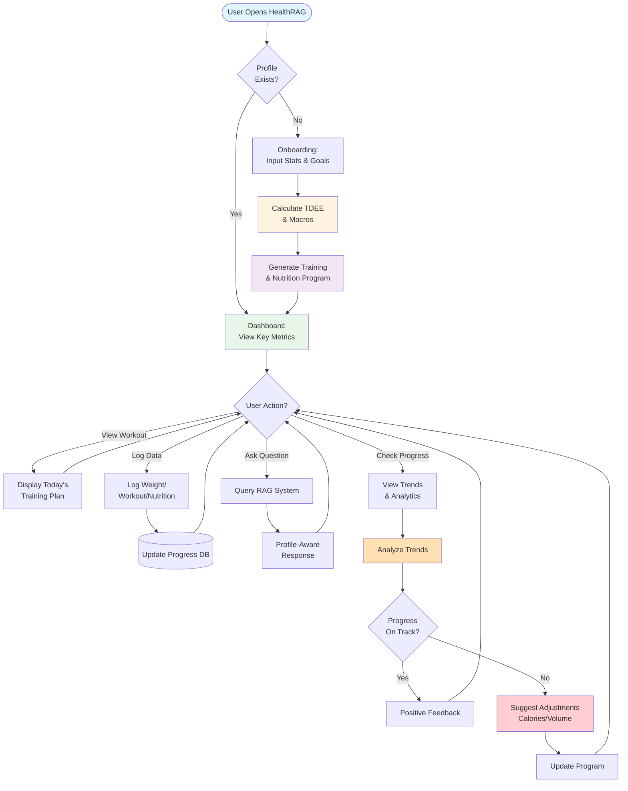
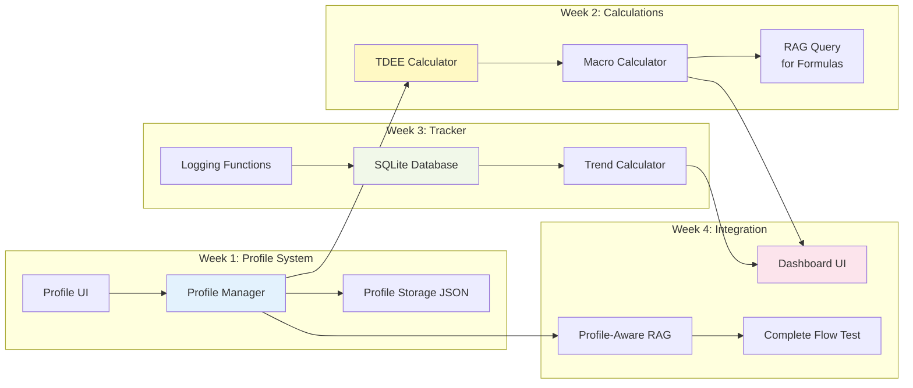
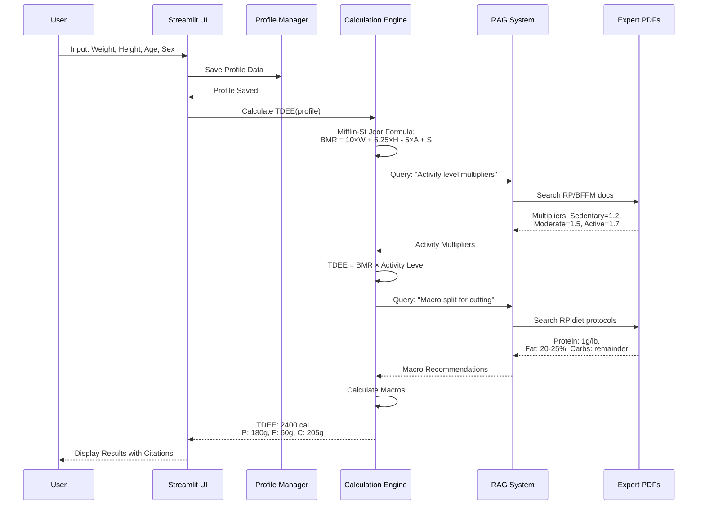

# HealthRAG v2.0 Vision: AI Personal Trainer & Nutritionist

## Mission Statement

**HealthRAG v2.0** is a personalized AI fitness coach that combines evidence-based knowledge from expert sources (Renaissance Periodization, Jeff Nippard, BFFM) with individual tracking and adaptive programming to guide users toward their fitness goals.

## Problem Statement

**Current Problem:**
- Too much fitness information scattered across books, PDFs, and programs
- Generic programs don't account for individual responses and progress
- Paid coaching is expensive ($200-500/month)
- Hard to know when/how to adjust training and nutrition based on results

**Solution:**
An AI system that:
1. Knows YOU specifically (stats, goals, preferences, progress)
2. Generates evidence-based programs from expert sources
3. Tracks your results (weight, measurements, performance)
4. Adaptively adjusts recommendations based on progress
5. Provides quick coaching answers when needed

## User Outcomes

### Primary Goal
**"Achieve my fitness goals (cutting, bulking, recomp) with personalized, evidence-based programming and adaptive coaching."**

### Success Metrics
- User follows program consistently (daily/weekly engagement)
- Measurable progress toward goals (weight, strength, measurements)
- User achieves target outcomes (lose fat, gain muscle, improve performance)
- System makes timely, helpful adjustments when progress stalls

## Visual Overview

### System Architecture Diagram



### User Journey Flow



### Phase 2 Component Diagram



### Data Flow: TDEE Calculation Example



## Core User Journey
```
Input:
- Personal stats: weight, height, age, sex
- Current fitness level (beginner/intermediate/advanced)
- Equipment access (home gym, commercial gym, minimal)
- Time availability (days per week, duration per session)
- Goals: cut (fat loss), bulk (muscle gain), recomp (both), maintain

Output:
- Baseline maintenance calories (TDEE calculation from PDFs)
- Initial macro targets (protein/carbs/fat split)
- Training program outline based on experience level
```

**First Concrete Feature:** "Tell me my daily macros based on my stats"
- Calculate TDEE (Total Daily Energy Expenditure)
- Understand baseline calories to maintain current weight
- Foundation for bulking/cutting adjustments

### 2. Program Generation
```
Input:
- User profile + goals
- Phase selection (cut/bulk/maintain)
- Program preferences (frequency, split, exercise selection)

Process:
- Query PDFs for program design principles (RP, Nippard, BFFM)
- Generate training program: exercises, sets, reps, progression
- Generate nutrition targets: calories, macros, timing

Output:
- 4-8 week training program
- Daily nutrition targets
- Progress checkpoints (when to assess and adjust)
```

### 3. Daily Use & Tracking
```
User Actions:
- "What's my workout today?"
- Log completed workout: "Bench press 225x5x3"
- Log daily weight: "My weight is 185 lbs today"
- Log measurements: "Waist 33 inches"
- Log nutrition: "I ate 2200 calories today" (optional)

System Responses:
- Display today's training plan
- Store logs in database
- Calculate trends (weight change, strength progression)
- Provide feedback: "Great session!" or "Weight trending up 0.5 lbs/week"
```

### 4. Progress Analysis & Adaptation
```
System Monitors:
- Weekly weight trends (7-day moving average)
- Rate of weight change (% body weight per week)
- Strength progression (volume load trends)
- Measurement changes (weekly/biweekly)

Adaptive Logic:
IF cutting AND weight_loss_rate > 1.5% per week:
    → "Rate too fast, increase calories 100-200" (cite RP guidelines)

IF cutting AND weight_loss_rate < 0.5% per week (2+ weeks):
    → "Progress stalled, decrease calories 100-200 or add cardio"

IF strength_not_progressing AND volume_below_landmarks:
    → "Add 1-2 sets per muscle group" (cite Nippard volume landmarks)

IF hitting strength PRs AND gaining weight on bulk:
    → "Excellent progress, maintain current plan"
```

### 5. Quick Reference & Coaching
```
User Queries:
- "How do I do Romanian deadlifts?" → Form cues from PDFs
- "What's my protein target?" → Profile-aware answer
- "Should I bulk or cut?" → Based on current stats and goals
- "How much cardio on a cut?" → RP recommendations + your schedule
```

## Development Roadmap

### Phase 2: User Profile & State Management (Weeks 1-4)

**Goal:** Enable personalized recommendations based on user stats

**Week 1: Profile System**
- Create `src/profile.py` - Profile management class
- Create `data/user_profile.json` - Profile storage
- Add profile input UI to Streamlit sidebar
- Implement CRUD operations (create, read, update, delete)
- Test: Create profile, view profile, update profile

**Week 2: Calculation Engine**
- Create `src/calculations.py` - TDEE and macro calculations
- Implement Mifflin-St Jeor TDEE formula
- Add activity level multipliers
- Query RAG for formulas from RP/BFFM PDFs
- Implement macro calculations for cut/bulk/maintain
- Test: Verify calculations match PDF recommendations

**Week 3: Progress Tracking Database**
- Create `src/tracker.py` - Tracking and logging
- Set up SQLite database: `data/progress.db`
- Create tables: daily_weights, measurements, workout_logs, nutrition_logs
- Implement logging functions
- Add logging UI to Streamlit
- Test: Log data, retrieve trends, calculate moving averages

**Week 4: Integration & First Milestone**
- Integrate profile with RAG queries
- Build "My Dashboard" view with key stats
- Calculate 7-day weight trends
- Enable profile-aware responses
- **MILESTONE:** "Tell me my daily macros based on my stats" working end-to-end
- User testing: Get baseline TDEE and macros

### Phase 3: Program Generation (Weeks 5-9)

**Goal:** Generate personalized training and nutrition programs

**Week 5-6: Training Program Generator**
- Create `src/program_generator.py`
- Build RAG queries for program design principles
- Implement program template system
- Generate programs based on profile
- Test: Generate sample programs, verify against PDF guidelines

**Week 7-8: Nutrition Planning**
- Enhance nutrition calculator
- Meal timing recommendations
- Food suggestions from PDFs
- Calorie/macro targets by phase
- Test: Generate nutrition plans

**Week 9: Program Display & Management**
- UI for viewing programs
- "Today's workout" view
- Week-at-a-glance calendar
- Program export (PDF/Excel)
- Test: Follow generated program for one week

### Phase 4: Adaptive Coaching (Weeks 10-14)

**Goal:** Analyze progress and adjust recommendations

**Week 10-11: Progress Analysis**
- Create `src/analyzer.py`
- Implement trend analysis algorithms
- Weight trend analysis (7-day MA, rate of change)
- Strength progression tracking
- Visualization (charts, graphs)
- Test: Analyze sample progress data

**Week 12-13: Adjustment Engine**
- Create `src/adjustments.py`
- Implement adjustment logic
- Nutrition adjustments (calories, macros)
- Training adjustments (volume, intensity)
- RAG-based recommendations with citations
- Test: Validate adjustment reasoning

**Week 14: Coach Interface & Polish**
- Proactive weekly check-ins
- Dashboard with key metrics
- Mobile-responsive UI improvements
- Full system integration testing
- User acceptance testing

### Phase 5: Polish & Advanced Features (Weeks 15+)

**Future Enhancements:**
- Voice input for workout logging
- Photo progress tracking
- Enhanced data visualizations
- Exercise video library
- Meal planning and grocery lists
- Community features (optional)
- Mobile app (React Native)

## Technical Architecture

### User Profile System

**File:** `src/profile.py`

**Data Structure:**
```json
{
  "personal_info": {
    "weight_lbs": 185,
    "height_inches": 72,
    "age": 35,
    "sex": "male",
    "activity_level": "moderately_active"
  },
  "goals": {
    "target_weight_lbs": 175,
    "phase": "cut",
    "timeline_weeks": 16,
    "target_rate_per_week": 1.0
  },
  "experience": {
    "training_level": "intermediate",
    "years_training": 5
  },
  "equipment": ["barbell", "dumbbells", "rack", "bench", "cables"],
  "schedule": {
    "days_per_week": 4,
    "minutes_per_session": 60,
    "preferred_split": "upper_lower"
  },
  "created_at": "2025-10-27",
  "updated_at": "2025-10-27"
}
```

### Progress Tracking Database

**File:** `src/tracker.py`
**Storage:** `data/progress.db` (SQLite)

**Schema:**
```sql
CREATE TABLE daily_weights (
  date DATE PRIMARY KEY,
  weight_lbs REAL NOT NULL,
  notes TEXT,
  created_at TIMESTAMP DEFAULT CURRENT_TIMESTAMP
);

CREATE TABLE measurements (
  date DATE NOT NULL,
  measurement_type TEXT NOT NULL,
  value_inches REAL NOT NULL,
  notes TEXT,
  created_at TIMESTAMP DEFAULT CURRENT_TIMESTAMP,
  PRIMARY KEY (date, measurement_type)
);

CREATE TABLE workout_logs (
  id INTEGER PRIMARY KEY AUTOINCREMENT,
  date DATE NOT NULL,
  exercise TEXT NOT NULL,
  sets INTEGER,
  reps INTEGER,
  weight_lbs REAL,
  rpe INTEGER,
  notes TEXT,
  created_at TIMESTAMP DEFAULT CURRENT_TIMESTAMP
);

CREATE TABLE nutrition_logs (
  date DATE PRIMARY KEY,
  calories INTEGER,
  protein_g INTEGER,
  carbs_g INTEGER,
  fat_g INTEGER,
  notes TEXT,
  created_at TIMESTAMP DEFAULT CURRENT_TIMESTAMP
);
```

### Calculation Engine

**File:** `src/calculations.py`

**Key Functions:**
- `calculate_tdee(weight, height, age, sex, activity_level)` - Mifflin-St Jeor + activity
- `calculate_macros(tdee, phase, preferences)` - Protein/carbs/fat targets
- `calculate_weight_trend(weights, days=7)` - Moving average
- `calculate_rate_of_change(weights, body_weight)` - Weekly % change
- `calculate_volume_load(sets, reps, weight)` - Training volume tracking

## Testing Strategy

### Unit Tests
- Profile CRUD operations
- Calculation accuracy (TDEE, macros)
- Database operations (insert, query, update)
- Trend calculations (moving averages, rates of change)

### Integration Tests
- Profile → Calculations → RAG responses
- Logging → Database → Dashboard display
- Program generation end-to-end

### User Acceptance Testing
- Create profile and get baseline macros
- Log daily weight for 1 week, verify trends
- Generate training program, follow for 1 week
- System provides accurate, evidence-based recommendations

## Success Criteria

### Phase 2 Success Criteria
- ✅ Can input complete user profile
- ✅ TDEE calculations match expert recommendations
- ✅ Macro calculations cite correct formulas from PDFs
- ✅ Can log daily weight and view 7-day trend
- ✅ RAG provides profile-aware responses
- ✅ Dashboard displays key metrics clearly

### Phase 3 Success Criteria
- ✅ Generated training program follows expert guidelines
- ✅ Program is specific and actionable (exercises, sets, reps)
- ✅ Nutrition plan is personalized to profile and phase
- ✅ Can follow program for 4+ weeks successfully

### Phase 4 Success Criteria
- ✅ System detects when progress stalls (weight, strength)
- ✅ Recommendations are actionable and evidence-based
- ✅ Adjustments cite expert sources
- ✅ Adjustments lead to resumed progress
- ✅ User engages with system consistently (daily/weekly)

### Overall Success Criteria
- ✅ User achieves a concrete fitness goal (complete cut/bulk cycle)
- ✅ Results are measurable and positive
- ✅ System replaces need for paid coaching ($800-2000 savings)
- ✅ User would recommend to others

## Competitive Advantages

1. **Evidence-Based:** Grounded in RP, Nippard, BFFM principles
2. **Personalized:** Knows your stats, history, preferences
3. **Adaptive:** Adjusts based on YOUR results, not generic plans
4. **Private:** All data stays local, no subscriptions, no tracking
5. **Free:** No monthly fees, one-time development investment
6. **Comprehensive:** Training + nutrition + coaching in one system

## Development Principles

### For Solo Developer (10-20 hrs/week)

1. **Incremental Value:** Each phase delivers usable functionality
2. **Test As You Go:** Manual testing with real data each week
3. **Simple First:** Basic features before advanced ones
4. **Documentation:** Write docs as you build for future reference
5. **User Feedback:** Use it yourself, iterate based on real usage

### Technical Principles

1. **Start Simple:** JSON files before complex databases
2. **Add Structure:** Refactor when patterns emerge
3. **Test Calculations:** Verify against PDF formulas
4. **Keep Local:** No cloud dependencies, works offline
5. **Maintain Privacy:** No telemetry, no data uploads

## Future Possibilities (Post-Phase 5)

- **Community Features:** Share programs, tips, progress
- **Wearable Integration:** Apple Health, Fitbit, Whoop
- **Photo Analysis:** Body composition estimation from photos
- **Exercise Library:** Video demonstrations with form cues
- **Meal Planning:** Specific meals and grocery lists
- **Supplement Stack:** Evidence-based supplement recommendations
- **Social Accountability:** Partner tracking and check-ins
- **Mobile App:** Native iOS/Android app
- **Voice Assistant:** Siri/Alexa integration for logging
- **AI Form Check:** Video analysis for exercise form

## Decision Log

**2025-10-27: Vision Approved**
- Path A selected: Build v2.0 properly (3-6 months)
- Phase 2 starts Week 1
- First milestone: Baseline TDEE and macro calculations
- Data tracking: Manual entry, test automation incrementally
- Testing: Use system personally, iterate based on real usage

---

**Status:** Vision Approved - Phase 2 Development Starting
**Last Updated:** 2025-10-27
**Next Review:** End of Phase 2 (Week 4)
